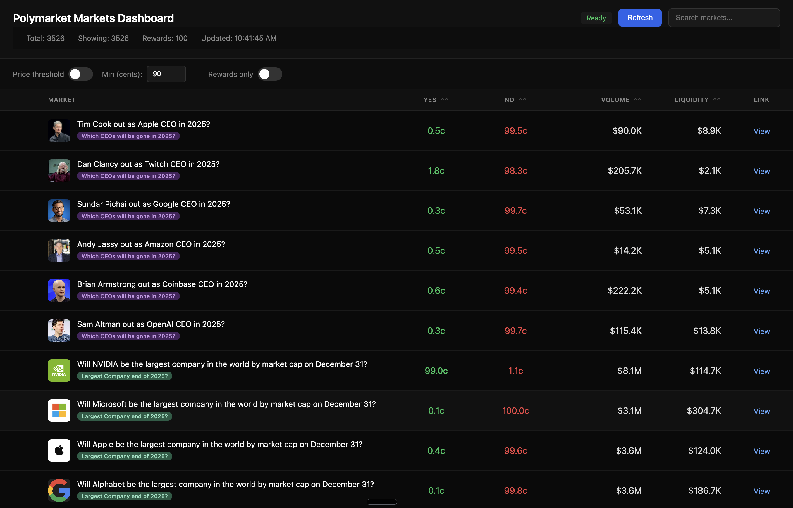

# Polymarket Markets Dashboard

A local web dashboard that monitors and displays all markets from Polymarket with price threshold filtering and rewards program indicators.



## Quick Start

```bash
./start.sh
```

This will:
1. Kill any existing process on port 8080
2. Start the markets dashboard server
3. Open your browser to http://localhost:8080

## Requirements

- Python 3.9+
- Playwright (for rewards scraping): `pip install playwright && playwright install chromium`

## Architecture

### Overview

The system uses a dual-process architecture:
1. **Gamma API Fetcher** - Gets all markets with event info
2. **Playwright Rewards Scraper** - Gets slugs of markets in the rewards program

```
+-------------------+
|   Gamma API       |----+
|   (All Markets)   |    |     +-------------------+     +----------------+
+-------------------+    +---->|  Markets Dashboard|---->|    Browser     |
                         |     |  (Python server)  |     |   Dashboard    |
+-------------------+    |     +-------------------+     +----------------+
| Polymarket.com    |----+            |
| /rewards page     |                 v
| (Playwright)      |           localhost:8080
+-------------------+
```

### How It Works

1. **Dual Data Fetching**: On startup and every 5 minutes, both processes run in parallel:
   - Gamma API fetches all active markets (~13,000+)
   - Playwright scrapes rewards page for market slugs (~2,600)
2. **Data Combining**: Markets are tagged with `has_rewards` flag if their slug appears in rewards
3. **Filtering**: Markets with <$10 volume or liquidity are excluded
4. **Caching**: Previous data is shown during refresh (no loading spinner)
5. **Serving**: Data is served via JSON API at `/api/markets`

### API Used

**Gamma API Endpoint**: `https://gamma-api.polymarket.com/events`

Parameters:
- `limit`: Number of events per request (max 100)
- `offset`: Pagination offset
- `active`: Filter for active events
- `closed`: Filter for closed status

Response includes events with nested `markets` array containing:
- `question`: Market question
- `outcomes`: JSON string of outcome names (e.g., `["Yes", "No"]`)
- `outcomePrices`: JSON string of prices (e.g., `["0.75", "0.25"]`)
- `volumeNum`: Total volume
- `liquidityNum`: Current liquidity

### Local API Endpoints

| Endpoint | Description |
|----------|-------------|
| GET / | Serves the HTML dashboard |
| GET /api/markets | Returns all fetched markets as JSON |
| GET /api/status | Returns fetching status and progress |
| GET /api/refresh | Triggers a new data fetch |

### Frontend Features

- **Rewards indicator**: USDC icon in first column for markets in rewards program
- **Rewards filter**: Toggle to show only rewards markets
- **Price threshold filter**: Show markets where Yes OR No price is above threshold (default 90 cents)
- **Color-coded event tags**: Each event gets a unique color, clickable to open event page
- **Sorting**: Click column headers (Yes, No, Volume, Liquidity) to sort
- **Search**: Filter markets by question or event name
- **Pagination**: Browse through results 100 at a time
- **Auto-refresh**: Data refreshes every 5 minutes (manual refresh resets timer)
- **Background refresh**: Shows cached data during refresh

## Files

```
polymarket_rewards_monitor/
  markets_dashboard.py    # Main application
  start.sh                # Startup script
  README.md               # This file
```

## Use Cases

### Finding Markets Near Resolution
Enable the price threshold filter and set it to 90+ to find markets where either Yes or No is trading above 90 cents - these are markets the crowd believes are likely to resolve soon.

### Finding Rewards Opportunities
Toggle "Rewards only" to see markets with active liquidity rewards programs. These markets pay you to provide liquidity.

### Market Discovery
Browse all active markets sorted by volume or liquidity to find popular trading opportunities.

### Research
Search for specific topics or events to find related prediction markets.

## Troubleshooting

**Port already in use**
The start.sh script automatically kills any process on port 8080. If issues persist:
```bash
lsof -ti:8080 | xargs kill -9
```

**API errors**
The Gamma API is public and does not require authentication. If you see errors, check your internet connection or try again later.

**Playwright errors**
If rewards scraping fails, ensure Playwright is installed:
```bash
pip install playwright
playwright install chromium
```

**Browser cache**
If UI changes don't appear, hard refresh with `Cmd+Shift+R` (Mac) or `Ctrl+Shift+R` (Windows).

## API Reference

For more information about the Polymarket API:
- [Polymarket API Docs](https://docs.polymarket.com/)
- [Gamma Markets API](https://docs.polymarket.com/developers/gamma-markets-api/get-markets)
- [Events API](https://docs.polymarket.com/api-reference/events/list-events)
